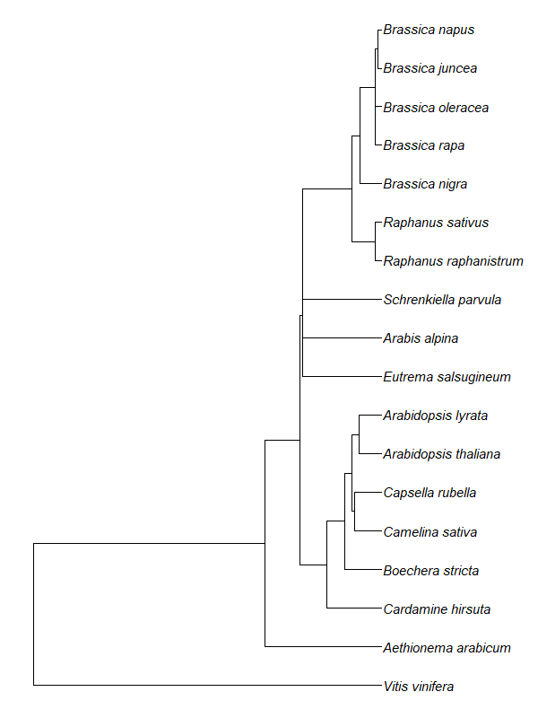

# Project: TF evolution in Brassicaceae
## Data gathering
### Genome assemblies
Proteome files (.pep or .fasta/fas/fa) for several (25) *Brassicaceae* species and/or cultivars and one non-*Brassicaceae* (*Vitis vinifera*) were downloaded from several public online repositories.Files were stored in ./data/Proteomes.

Sources: Phytozome13, BRAD (brassicadb.cn), PLAZA v5.0, CoGe, Genome Warehouse, AetarDB, ChirsutaDB, NCBI Assembly,... 

### Phylogenetic tree
A newick file with all available species was downloaded from the TimeTree database (missing *B. retrofracta*, *B. carinata* and *C. grandiflora*). Distances and node annotations were removed as the tree will still need adjusting.

 

NCBI Genome Workbench was used to construct a separate phylogenetic tree which would hopefully clear up the missing species' place in the phylogeny and correct dubious branch connections. Most genome assemblies of the selected 26 genomes were present in the NCBI database, however, a multi-species genome alignment was unfeasible. It was opted to use either chloroplast or mitochondrial genomes depending on the availability of data. Chloroplast genomes were most prevalent and consequently a phylogeny was constructed for the available (sub)species.

 

There was uncertainty about the interconnection within the *Brassiceae* tribe: 1) whether *Raphanus* is closer related to certain *Brassica* species or not and 2) where the allotetraploid should be placed, considering they are hybrids of each two other *Brassica* species. Ultimately, by perusing the scientific literature, the hybrid species were placed next to their maternal subgenomes (*B. carinata* with *B. nigra*, *B. juncea* with *B. rapa*) or next to both parental if these are closely related themselves (*B. napus* with *B. oleracea*), as depicted in the NCBI-derived tree. Both *Raphanus* species were opted to be kept separate from *Brassica*, as they are described as different genera and to not make the tree too confusing. The final phylogenetic tree is available in ./data as 'Better_species_tree.nwk.txt'.

______

## Data extraction
### Exploration and summary
For each proteome files, the number of protein sequences was counted. Additionally, by combing through the transcript ID for each sequence (the header starting with '>') and to find the gene IDs and only selecting the unique ones, the number of genes could be counted. This was executed through a specific sequence of substitutions (using `gsub()`) that could be applied to all files in the dataset. This count data was put into a dataframe. 
Genome assembly version and reference study for each genome were added to a separate .txt file (Genome_references.txt) and read in, so it could be added to the dataframe before it was exported as an image to ./products/tables.

### Generating Primary Transcript files
A function was defined that accepts a XStringSet data object (e.g. the original proteome file read in as a AAStringSet) and returns the same object but filtered in a way that only includes the longest protein sequences for each gene ID. In this function, same substitutions to derive the gene ID are used as before on the names of each protein sequence and these new 'clean' names are added to a dataframe, along with the original names and the length of each sequence. The dataframe is grouped by the 'clean names' and filtered on maximum sequence length. However, in some cases the number of sequences is still higher than what the summary table generated above reports. This is because sequences of equal (maximum) length are retained after the imposed filtering. These are errors from the original annotation files that annotated the same transcripts twice (or more) as a quick check through the raw data shows both equal length annotations have the same sequence. In these instances, only the first annotated duplicate was retained.

With the help of the summary table, it can be discerned which files need to be filtered (i.e. the `Coding genes` and `Annotated proteins` columns have different counts for a certain genome). A directory (Proteomes_clean) is made in ./products/result_files if it doesn't exist yet and the function is applied to the genomes that needed to be filtered. New files get names assigned according to the species (+ cultivar/subspecies) adjoined with _*PrimaryTranscript.pep* and if they don't yet exist in this directory, the new XStringSet object is written to the file.

_______

## TF Prediction
### Generating the TF prediction files
A new directory is made in ./products/result_files called **TF_Predictions** in which for each genome an empty .txt file is generated (based on the species name embedded in the Proteomes_clean files). The files in the **Proteomes_clean** directory are committed to the PlantTFDB TF prediction server and the resulting prediction data is copied to the corresponding empty */species_name/*_TF.txt and saved.

### Making a table of TF counts
In order to further analyze the TF family size differences between the pre-selected genomes an array is constructed depicting the gene counts for each TF family and for each genome. The TF_prediction files are read in as a list and a dataframe is initialized consisting of 1 column with all 58 different TF families. A function is written that reads a .txt file in table format, selects the second column (which contains the TF family allocation) and table summarizes this column. This results in a new table which depicts for each TF family the number of times it appeared in the files (= the TF family size). This in converted to a new dataframe with as row names the TF family names and as column names `Family` (for the TF family name column) and the `/Species_name/` (for the TF counts column). This dataframe is returned when the function is called.
After applying the function to all files, the resulting dataframes are merged to the original one with the TF family names through the `Family` column. The reason we can't use any of the newly constructed dataframes as the original is that it is uncertain if all TF families have been predicted for each genome. Now, when a dataframe containing missing TF families is merged to the one containing all TF families, this family will show up as a *NA* value. In the end, the `Family` column is used to identify the row names and the column itself is deleted.

The resulting dataframe with the TF families as row names and the species' names as column names is written as a table (TF_CountTable.txt) to ./products/tables.

_______

## TF family analysis plots
### Heatmap construction
The goal is to present heatmaps of the TF family count data next to a species tree in which the branches of the tree line up with the data from the TF count table. In order to do this, the phylogenetic tree is read in as a newick type object using `treeio::read.newick()` and then converted with `ggtree::ggtree()` to a usable object. The Tf count table is read as a matrix and the rows are reordered based on the order of the ggtree object (using `tf_species_matrix[,ggtree::get_taxa_name(species_tree)]` where tf_species_matrix is the count table and species_tree the ggtree object).

The count table matrix needs to be transposed, so the species names are in the rows and the Tf families in the columns. In order the plot with ggplot, it also needs to be converted to a (molten) dataframe. Four different heatmap plots are constructed: one with the raw TF counts, one where the counts are log2 rescaled, one where the values depict a fold change (FC) between each of the *Brassicaceae* and *V. vinifera* (also log2 rescaled for a better overview) and lastly one where the data is first log2 rescaled and then a FC is performed on this rescaled data. The latter of these is similar to the one before it, but it more heavily accentuates significant differences in the Tf counts. However, it also over-exaggerates small differences that look significant due to their low values (e.g. TF count differences lower than ~5).

The heatmaps are each coloured range from a faint yeloow to dark green. In order to read the counts in darkly coloured cells,  counts above a certain quantile value are written in a lighter font colour. For each heatmap, these quantiles differ, so they have to be calculated four times.

The raw count data is used as is, while for the log2 rescaled heatmap the data is first rescaled and rounded to fit into the heatmap cells. For the FC heatmap, each row is divided by the *V. vinifera* TF familt count corresponding to this row, the log2 rescaled and then rounded. For the last heatmap, the order of rescaling and row dividing is flipped. 

### Completion of the plots
The display of the phylogenetic tree labels is modified to make it look nicer: underscores are replaced with spaces and the labels are italicized (since this is the norm for species names). A new ggtree is constructed, this time aligned and parsed (this allows the italicization) and the x-axis limit is adjusted so all names fit on the plot. The tree is wrapped together with each heatmap through the `wrap_plots()` function from the `patchwork` package so that the tree takes up 1/5 of the space and the heatmap 4/5. The wrapped plots are exported to ./products/plots as png's.
The correct plots are currently named ending in _*Manual.png*, the other ones were previous attempts through the use of the `tfhunter` package or with `pheatmap` instead of `ggplot() + geom_tile`.
